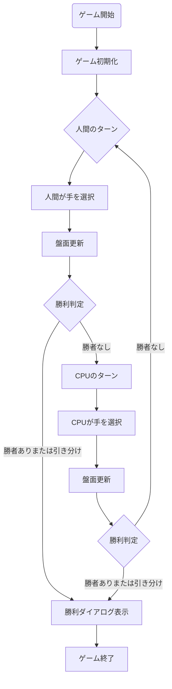
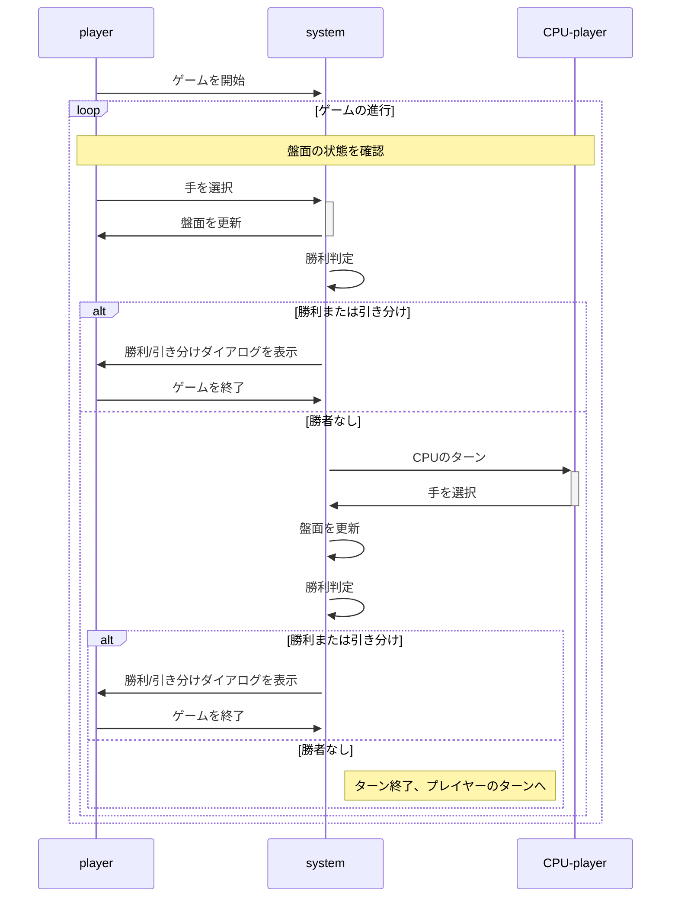

# python tic tac toe

## 概要

python で作成した GUI で遊べる CPU 対戦三目並べゲームです。

## 実行方法

このプログラムは`Python 3.11.6`で動作することを確認しています。それ以外のバージョンでの動作は保証しません。
また以下の動作確認では以下のことができている前提で説明を行います。

- python 環境の構築(以下の二つのどちらかを想定しています)
  - poetry が実行可能な環境
  - pip が実行可能な環境
- git のインストール

### 1. リポジトリのクローン

```zsh
git clone https://github.com/you22fy/tic_tac_toe.git
cd tic_tac_toe
```

### 2. 実行の準備

#### poetry を使用する場合

```zsh
poetry install
```

#### pip を使用する場合

```zsh
pip install -r requirements.txt
```

### 3. 実行

#### poetry を使用する場合

```zsh
poetry run python python_tic_tac_toe/main.py
```

#### pip を使用する場合

```zsh
python python_tic_tac_toe/main.py
```

### 4. 楽しむ

- ゲームが開始されるので、CPU と対戦してください。
- CPU は開いてるマスからランダムに１つ選んで手をうつようになっています。
  - CPU の挙動を変更して、より強くすることも可能です。(future work)

## 使用技術
- python 3.11.6
- tkinter
- poetry

## mermaid 図

プログラム全体のフローチャートとシーケンス図を以下に示します。

### フローチャート



### シーケンス図


